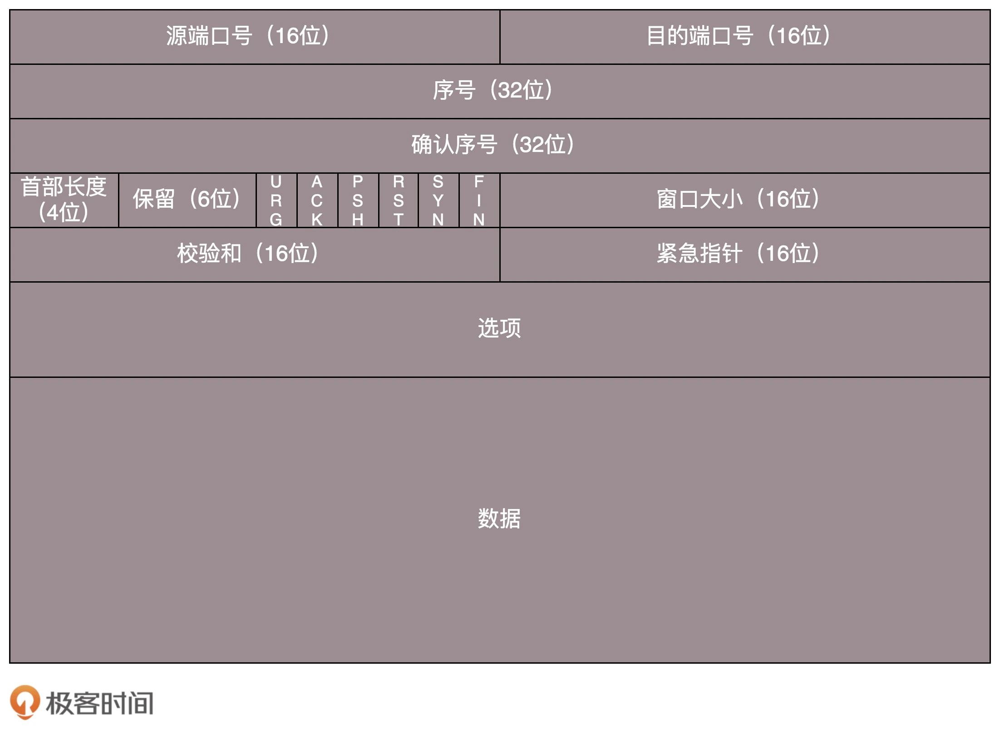
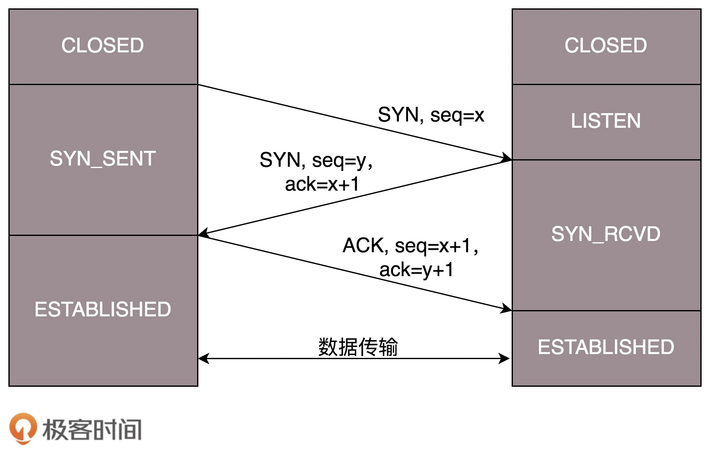
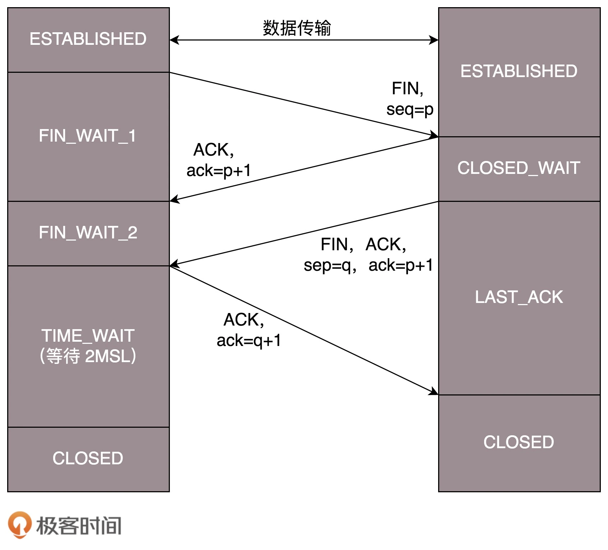

tcp

```
所谓的建立连接，是为了在客户端和服务端维护连接，而建立一定的数据结构来维护双方交互的状态，用这样的数据结构来保证所谓的面向连接的特性。

面向连接
可靠交付：无差错、不丢失、不重复、并且按序到达
字节流
拥塞控制

有状态服务


```









`MSL 是 Maximum Segment Lifetime，报文最大生存时间`


udp

```shell
```

